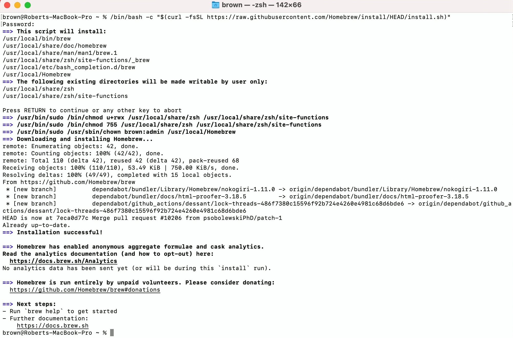
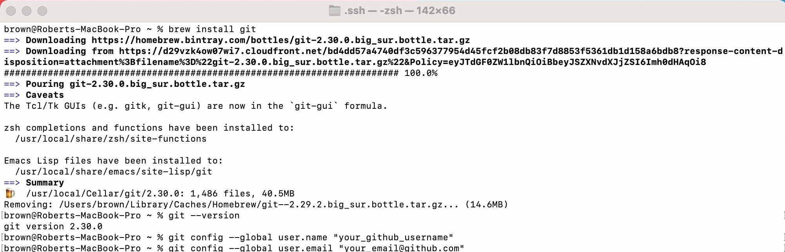
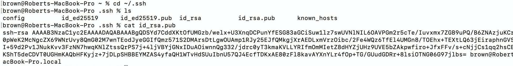
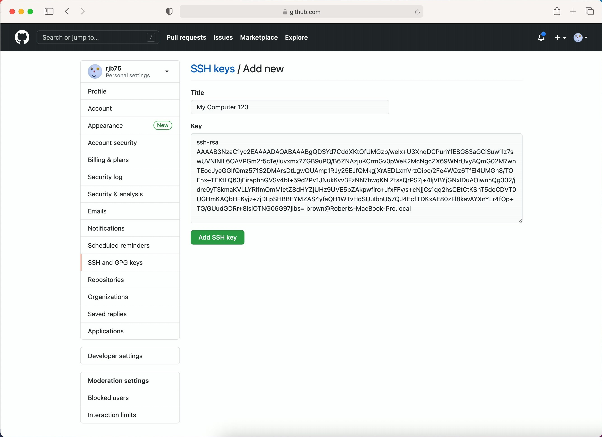
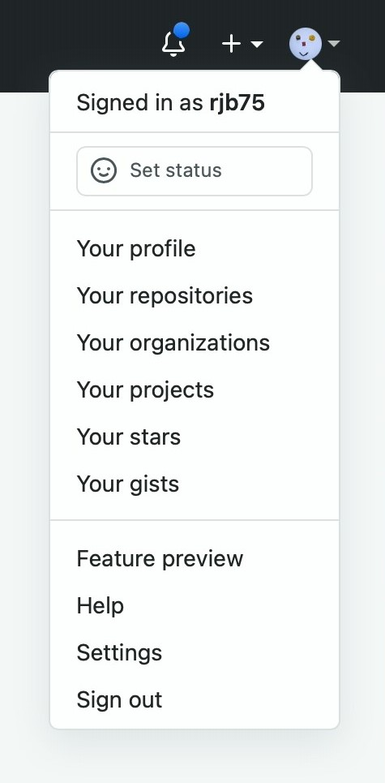
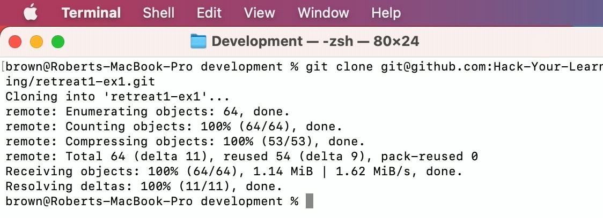
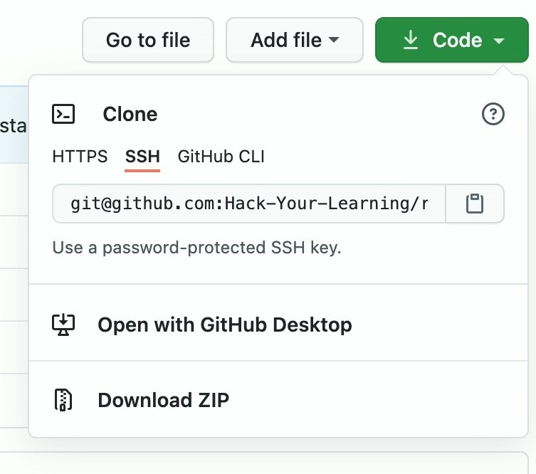
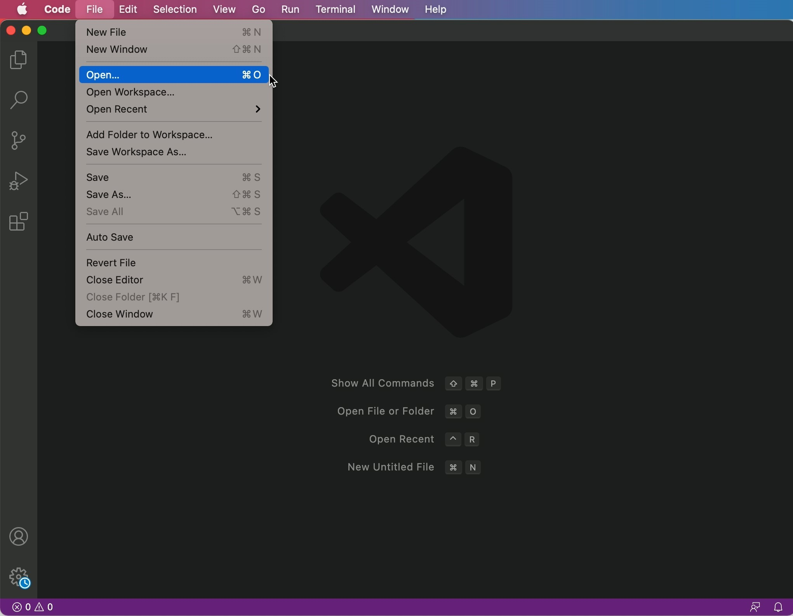
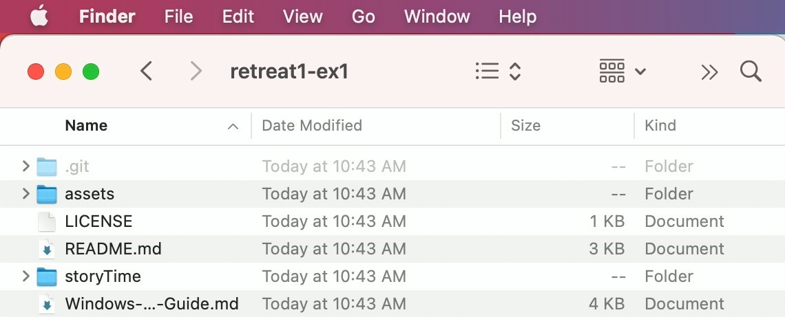
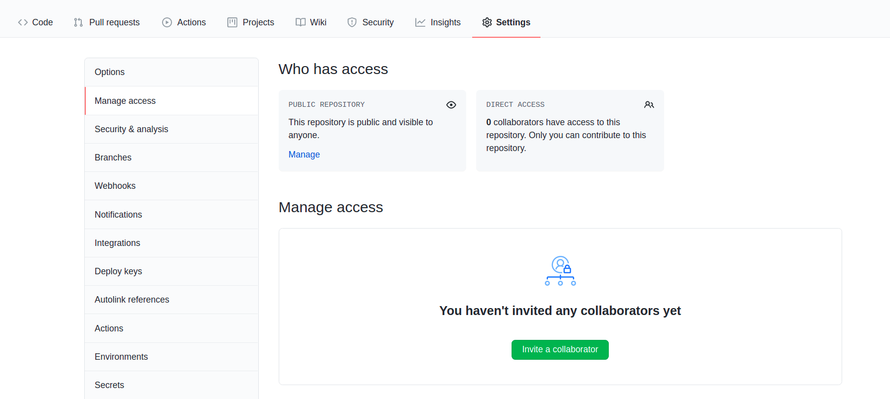

<h1 style="font-family: -apple-system, BlinkMacSystemFont, 'Space Mono', sans-serif;">Git Install Guide - Mac
</h1>

## 1. Open the Terminal application on your computer

**Note:** You will require sufficient permissions on your device to install git and it's dependencies. This includes administrator permissions and the password for the user

To install git and it's dependencies we will use the command line through the terminal on Mac.

## 2. Install Homebrew

In order to install git on a Mac we need to install Homebrew. Homebrew is a package manager that allows for the easy installation of packages commonly used in development.

The latest version of Homebrew can be installed using the command `/bin/bash -c "$(curl -fsSL https://raw.githubusercontent.com/Homebrew/install/HEAD/install.sh)"`

## 3. Install Git

Once Homebrew is installed you can use it to install git. The `brew install [name]` command tells Homebrew to install the package that you specify.

To install git use `brew install git`

Once git is installed you will need to set your username and email. This is done using the command `git config --global user.name "your_github_username"` and `git config --global user.email "your_email@github.com`

## 4. Generate SSH Keys

To make our GitHub experience smoother we will generate ssh keys. This allows us to securely communicate with GitHub. If you're interested in how this works you can research public/private key encryption. To generate an ssh key pair type `ssh-keygen`. Accept the defaults.

## 5. Add our ssh keys to GitHub

We now need to add the public key to our GitHub account. 
- Type `cd ~/.ssh`. This will change directory to the folder we just made the keys in. If we type `ls` it will list the contents of this folder. 
- Type `cat id_rsa.pub` to show the contents of your public key. 
- Copy your public key

Next navigate to github.com and create an account if needed. To edit your ssh keys: 
- Click your profile picture in the top right
- Go to settings
- Choose SSH and GPG keys from the sidebar
- Click "New SSH Key".
- Paste the contents of your public key in the key field. The title field doesn't really matter. 
- Click "Add SSH key".

Your ssh keys are now set up.

## 6. Fork the HYL Repository - only one team member needs to do this!
To work on the HYL project one member of your team will need to fork the repository. To do so, navigate to https://github.com/Hack-Your-Learning/retreat1-ex1. Click "Fork" in the top right corner. This will create a copy of this repository for your team to work on. GitHub should redirect you to your copy when you create it. If it did not you can find your copy by clicking on your profile picture and then "your repositories".

## 7. Clone the repository
Now that we have our fork on GitHub we need a local copy. We get this copy with the "clone" command. First copy the ssh link by clicking the green "Code" button, choose ssh and then copy the link. Go back to your git bash and `cd` to your project directory. We can clone the project with `git clone <your link>`. If it asks you about adding to known hosts say yes.

## 8. Open in your preferred text editor
You will now be able to open the files in your favorite text editor. Below you can see how to open it in VSCode.

## 9. Add collaborators
If you're working with a team you will want to add collaborators. From your repository's page on GitHub, click
- Settings
- Manage Access
- Invite Collaborator

You can add your collaborators by email or GitHub username. To contribute they should clone the repository as described above. Note that there is no need for your teammates to fork either the HYL repository or your forked repository! They should *clone* the repository that you have just *forked*.

