# Windows Install Guide
## 1. Download the installer from https://git-scm.com/downloads 
Click the download button and your download should start immediately. If it doesn't you can manually click Windows 64 bit. Keep track of where you saved the installer.  
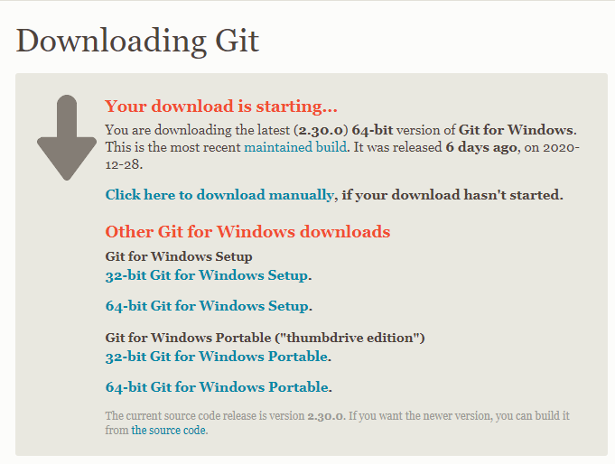
## 2. Run the installer
You can accept the default for most of the install. However, it is recommended to pause at the following critical steps to double check the information.
### Text editor choice
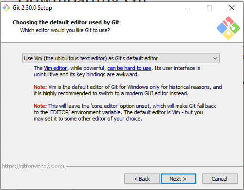.  
This step is where you choose your text editor for git bash. It's ok to stick with the default, but if you have a preferred text editor you should specify that here.
### Default branch
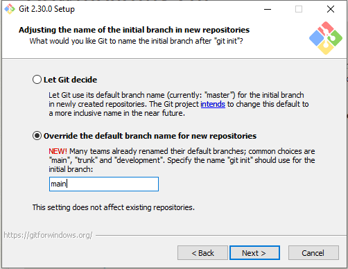.  
It is recommended to choose the default branch name to be "main" since this is what Github uses.
## 3. Start your git bash
First create a folder to house your project. Change into this folder. You can then start a git bash by right clicking and selecting "Git Bash Here". This will open a terminal like that shown below. All your commands in this workshop will be executed in the git bash.
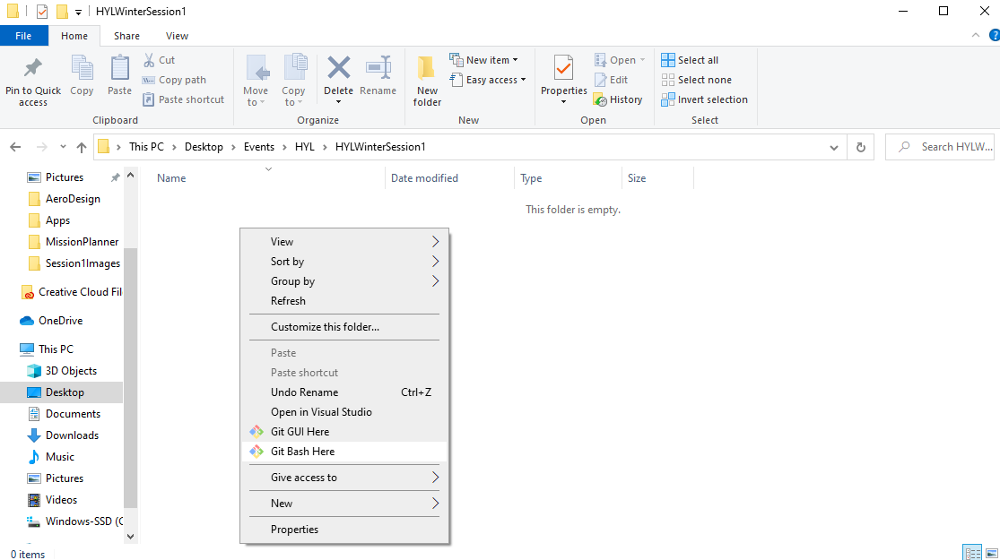
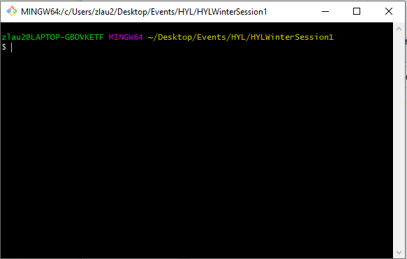
## 4. Generate ssh keys
To make our GitHub experience smoother we will generate ssh keys. This allows us to securely communicate with GitHub. If you're interested in how this works you can research public/private key encryption. To generate an ssh key pair type `ssh-keygen`. Accept the defaults.
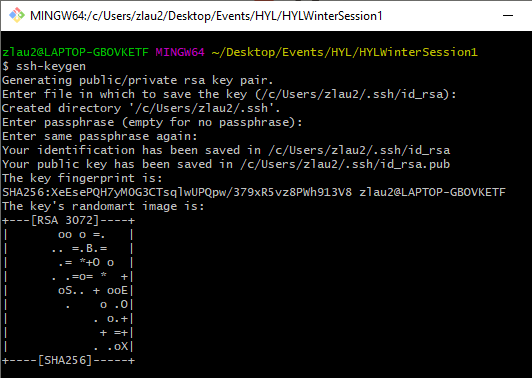
## 5. Add our ssh keys to GitHub
We now need to add the public key to our GitHub account. First we need to copy the public key we just generated. Type `cd ~/.ssh`. This will change directory to the folder we just made the keys in. If we type `ls` it will list the contents of this folder. Type `cat id_rsa.pub` to show the contents of your public key. Copy them.  
Next navigate to github.com and create an account if needed. To edit your ssh keys click your profile picture in the top right and then go to settings. In the sidebar that opens up choose SSH and GPG keys. And then "New SSH Key". Paste the contents of your public key in the key field. The title field doesn't really matter. Click "Add SSH key". Your ssh keys are now set up.
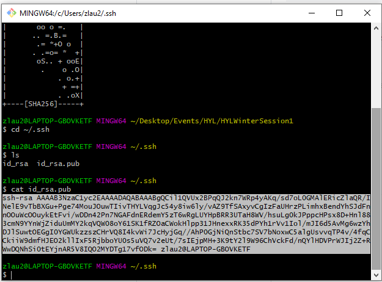  
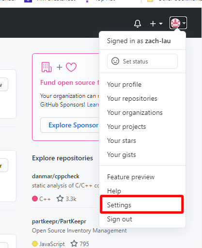
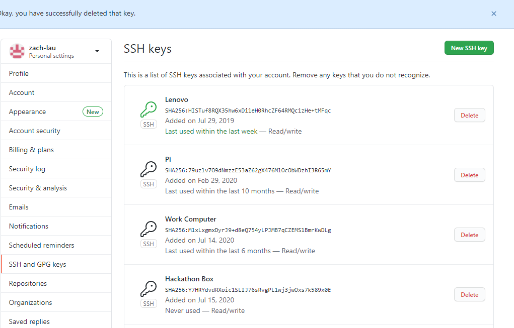
## 6. Fork the HYL Repository - only one team member needs to do this!
To work on the HYL project one member of your team will need to fork the repository. To do so, navigate to https://github.com/Hack-Your-Learning/retreat1-ex1. Click "Fork" in the top right corner. This will create a personal copy of this repository. GitHub should redirect you to your copy when you create it. If it did not you can find your copy by clicking on your profile picture and then "your repositories".
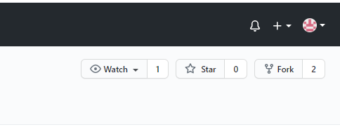
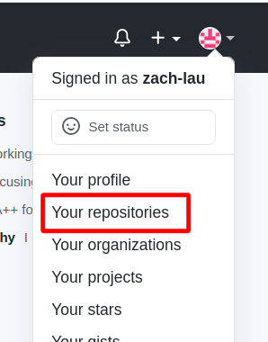
## 7. Clone the repository
To work on this project you will need to download the files. This is done by cloning. First copy the ssh link by clicking the green "Code" button, choose ssh and then copy the link. Go back to your git bash and `cd` to your project directory. Now we can clone the project with `git clone <your link>`. If it asks you about adding to known hosts say yes.
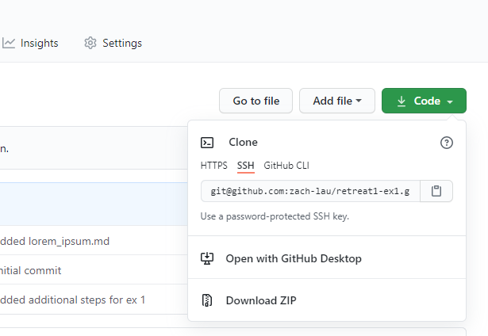
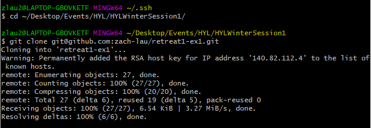
## 8. Open in your preferred text editor
You will now be able to open the files in your favourite text editor. Below you can see how to open it in VSCode.
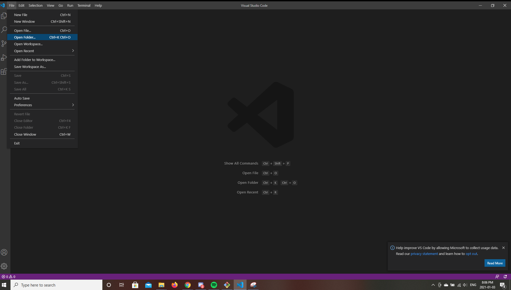
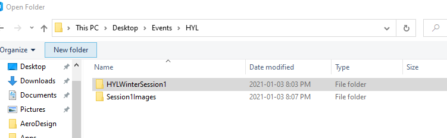
## 9. Add collaborators
If you're working with a team you will want to add collaborators. Click "Settings" then "Manage Access" and "Invite a collaborator". You can add your teammates by their GitHub username or email.

